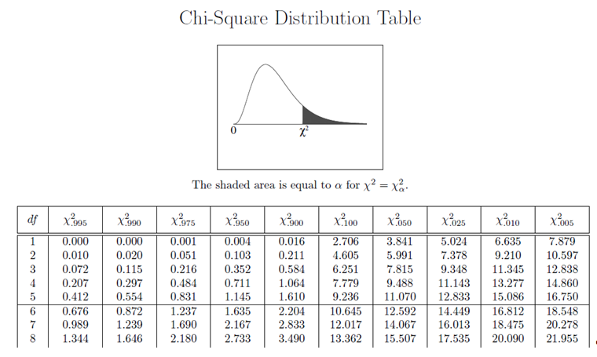
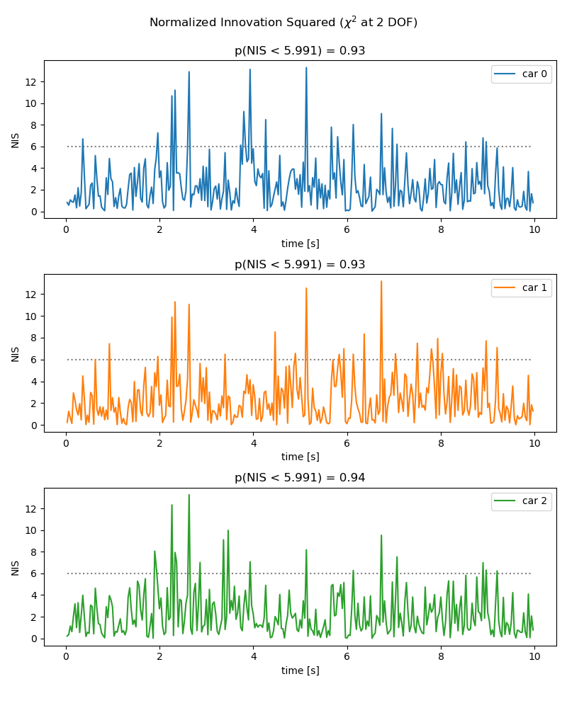
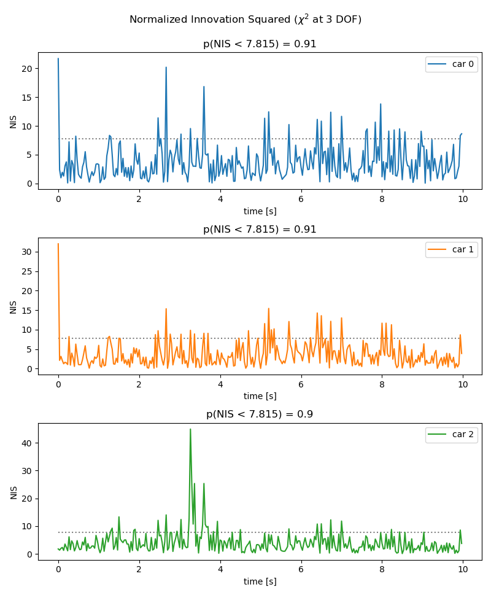
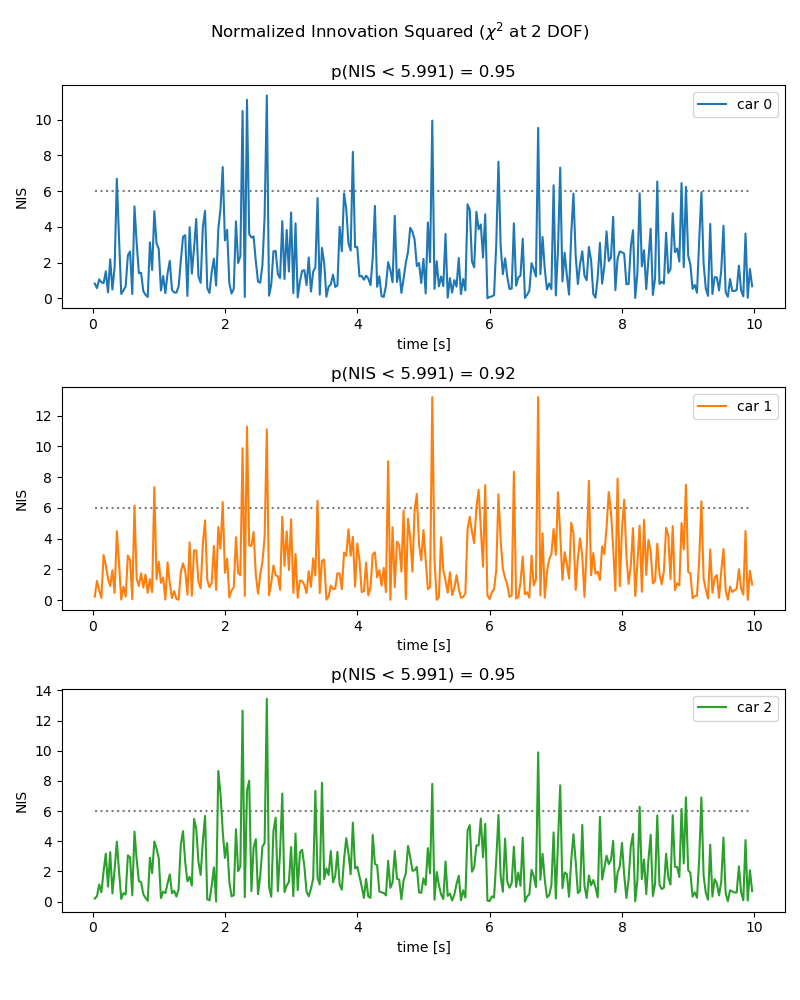
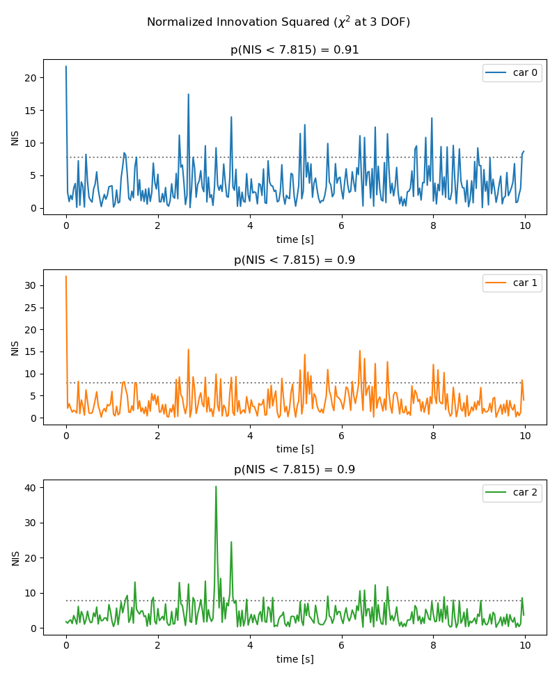

# Unscented Kalman Filtering

Sensor Fusion UKF Highway Project

In this project you will implement an Unscented Kalman Filter to estimate the state of multiple cars on a highway using noisy lidar and radar measurements. Passing the project requires obtaining RMSE values that are lower that the tolerance outlined in the project rubric. 

The main program can be built and ran by doing the following from the project top directory.

1. mkdir build
2. cd build
3. cmake ..
4. make
5. ./ukf_highway

Note that the programs that need to be written to accomplish the project are src/ukf.cpp, and src/ukf.h

The program main.cpp has already been filled out, but feel free to modify it.

`main.cpp` is using `highway.h` to create a straight 3 lane highway environment with 3 traffic cars and the main ego car at the center. 
The viewer scene is centered around the ego car and the coordinate system is relative to the ego car as well. The ego car is green while the 
other traffic cars are blue. The traffic cars will be accelerating and altering their steering to change lanes. Each of the traffic car's has
it's own UKF object generated for it, and will update each indidual one during every time step. 

The red spheres above cars represent the (x,y) lidar detection and the purple lines show the radar measurements with the velocity magnitude along the detected angle. The Z axis is not taken into account for tracking, so you are only tracking along the X/Y axis.

---

## Other Important Dependencies
* cmake >= 3.5
  * All OSes: [click here for installation instructions](https://cmake.org/install/)
* make >= 4.1 (Linux, Mac), 3.81 (Windows)
  * Linux: make is installed by default on most Linux distros
  * Mac: [install Xcode command line tools to get make](https://developer.apple.com/xcode/features/)
  * Windows: [Click here for installation instructions](http://gnuwin32.sourceforge.net/packages/make.htm)
* gcc/g++ >= 5.4
  * Linux: gcc / g++ is installed by default on most Linux distros
  * Mac: same deal as make - [install Xcode command line tools](https://developer.apple.com/xcode/features/)
  * Windows: recommend using [MinGW](http://www.mingw.org/)
 * PCL 1.2

## Basic Build Instructions

1. Clone this repo.
2. Make a build directory: `mkdir build && cd build`
3. Compile: `cmake .. && make`
4. Run it: `./ukf_highway`

## Editor Settings

We've purposefully kept editor configuration files out of this repo in order to
keep it as simple and environment agnostic as possible. However, we recommend
using the following settings:

* indent using spaces
* set tab width to 2 spaces (keeps the matrices in source code aligned)

## Code Style

Please stick to [Google's C++ style guide](https://google.github.io/styleguide/cppguide.html) as much as possible.

## Generating Additional Data

This is optional!

If you'd like to generate your own radar and lidar modify the code in `highway.h` to alter the cars. Also check out `tools.cpp` to
change how measurements are taken, for instance lidar markers could be the (x,y) center of bounding boxes by scanning the PCD environment
and performing clustering. This is similar to what was done in Sensor Fusion Lidar Obstacle Detection.

## Project Instructions and Rubric

This information is only accessible by people who are already enrolled in Sensor Fusion. 
If you are enrolled, see the project page in the classroom
for instructions and the project rubric.

## Normalized Innovation Squared (χ-squared test)

In order to determine how well the uncertainty of the system was captured,
the Normalized Innovation Squared (NIS) scores for each measurement were
taken and evaluated.

From the following table we find that a system of 2 degrees of freedom (DOF)
like the LiDAR sensor, a 95% value of 5.991 (χ².050) is to be expected - i.e.
95% of all NIS values for a system of 2 DOF are less than 5.991 - whereas
a system of three DOF like the Radar has an according 95% value of 7.815:

Initially,

- an acceleration standard deviation of 2m/s², and
- a yaw acceleration standard devation of 45°/s²

were assumed. At this configuration, the following NIS scores were observed for the LiDAR.

Here, we can observe that approximately 93% of all values
are below threshold, i.e. we overestimated the system's uncertainty.

For the Radar we find that about 90% of all values are below
threshold, reinforcing the point.

After this, the uncertainty was tuned to the following values:

- **acceleration standard deviation:** 2m/s²
- **yaw acceleration standard devation:** 22.5°/s²

Interestingly, this affected the LiDAR measurements, which
now closely resemble the wanted distribution:

The Radar measurments, however, did not change significantly:

